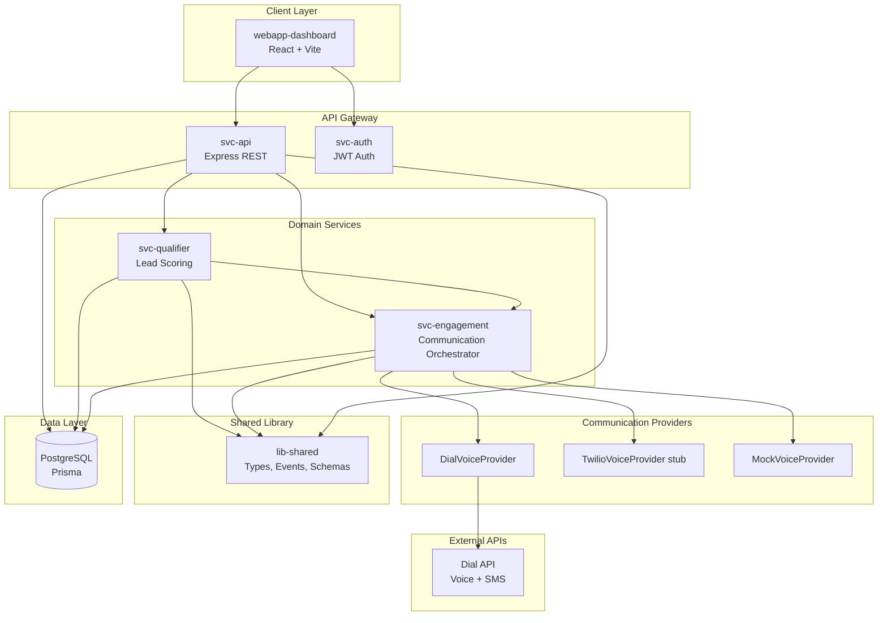
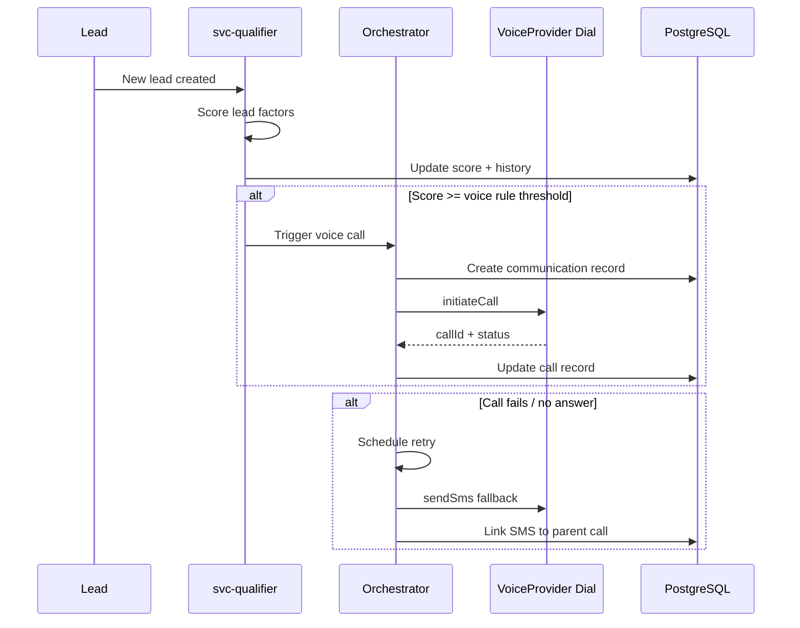

# EstateCraft Architecture

## Overview

EstateCraft is a communication orchestration platform for real estate sales. It uses a provider-based architecture so voice and SMS channels can be swapped (Dial, Twilio, mock) without changing business logic.

## Architecture Diagram

## Communication Flow

## Provider Abstraction

All voice/SMS operations go through `IVoiceProvider` in `lib-shared`. Dial-specific code lives only in `svc-engagement/src/providers/dial-voice-provider.ts`.

| Provider | Status | Use Case |
|----------|--------|----------|
| `mock` | Implemented | Local dev, demos |
| `dial` | Implemented | Production voice + SMS |
| `twilio` | Stub | Future integration |

Set `VOICE_PROVIDER` environment variable to select provider.

## Key Packages

| Package | Responsibility |
|---------|----------------|
| `lib-shared` | Domain types, Zod schemas, events |
| `svc-api` | REST API, Prisma store, route handlers |
| `svc-engagement` | Provider factory, orchestrator, retry/SMS fallback |
| `svc-qualifier` | Lead scoring, voice trigger on threshold |
| `infra-migrations` | Prisma schema, seed data |
| `webapp-dashboard` | Admin UI |

## Deployment

- **Local**: Docker Compose (Postgres, RabbitMQ, Redis) + `npm run dev`
- **Vercel**: Serverless Express via `api/index.ts`, static dashboard, external Postgres
